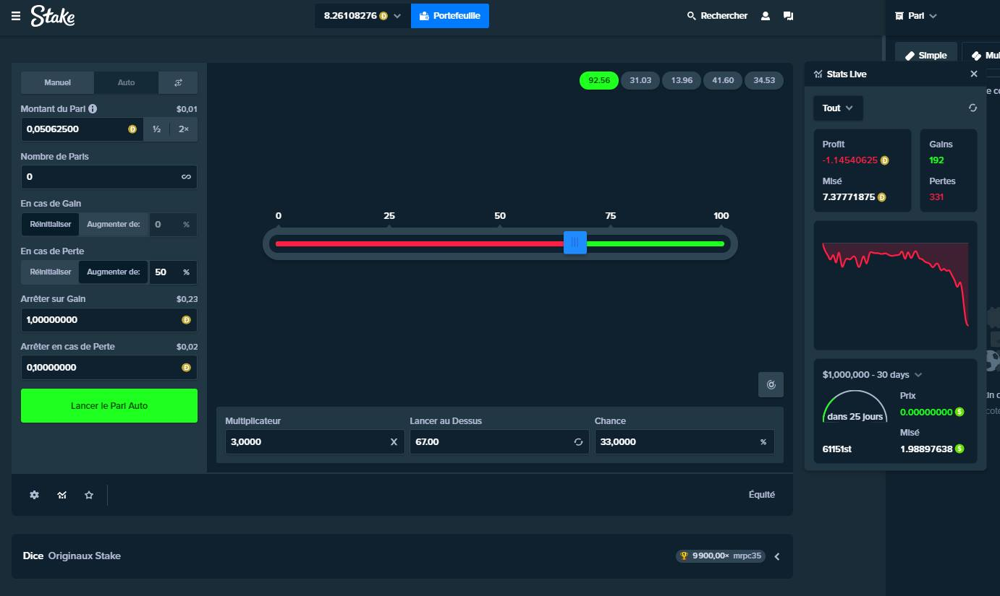

# Comment j'apprends les échecs

Comme vous le voyez sur ce repository j'ai fais la liste de quelques livres dont les auteurs me fascinent comme Josh, je regardes des films, des vidéos sur YT et j'apprends

L'ouverture est quelque chose qui m'a toujours intrigué depuis que je suis jeune et que comme tout le monde je me suis fais avoir avec le coup du berger

J'ai rejoins le discord de ChessComFrance et y a beaucoup d'ambiance surtout que c'est en français et ça j'arrive pas à m'adapter au rythme

Je suis un joueur solitaire qui prend son temps et prend du plaisir à apprendre à jouer aux échecs du coup chesscom est un endroit très bien pour moi pour pratiquer en toute sécurité sans afficher mon identité j'ai pris un pseudo 

## Mes blocages

Josh me fascine car il sait écrire et sait mettre ses idées sur un bouquin, lui il est parti des échecs vers les arts martieux et le go, moi j'ai fais le contraire en partant des arts martiaux car je devais absolument vaincre les démons qui sont en moi d'un enfant d'une famille nombreuse qui vit dans un quartier populaire en Algérie et qui s'est retrouvé en France pour faire ses études

Quand je lis son livre je trouves que tout ce qu'il dit concernant les outils est juste parfait, le coup d'échec sur la première ligne est juste parfait, il fallait le voir

Je me souviens encore de l'imam qui nous dis que les échecs c'est comme les jeux d'argent et que c'est haram, c'est pour ça que j'ai un blocage pour y jouer

J'ai cherché multiples moyens de changer de religion pour pouvoir faire des choses et le dudism est ce qu'il me fallait sauf que parfois j'ai l'impression de discuter avec un groupe d'lacooliques anonymes

Bizarrement je discutes avec des potes du quartier qui jouent au poker en ligne et je me suis mis au Blackjack du coup les échecs m'ont donné envie de lire sur ce jeu et de comprendre la stratégie, du coup avec l'arrivée des bitcoins sur le marché j'ai décidé de jouer en ligne pour apprendre

## Pourquoi un blocage

Etant originalire d'une religion comme l'islam j'ai joué mes premiers DOGES sur STAKE.COM pendant la coupe d'Europe 2021 en plein COVID et en pleine dépression générale

En une soirée pour fêter la victoire de l'Italie (même si j'ai parié contre parce que je penses que la France a perdu à cause des paris en ligne) j'ai perdu plus d'1 DOGE ce qui est beaucoup quand on voit le BITCOIN

Alors ce que l'on cherche à comprendre c'est pourquoi Abu Taleb a décidé que les échecs étaient comme un jeu d'argent et pourquoi il y a ce blocage chez moi qui ne me permet pas d'exploiter à 100% mes capacités intellectuelles afin d'être un bon joueur d'échecs

Ceci a été le cas pendant toute mon enfance et même aujourd'hui je n'arrive pas à dépasser ce blocage

Ceci dit le jeu d'échecs n'est pas comme les jeux d'argents certes mais c'est comme si et pourquoi ça l'est 

C'est ce qu'on va voir dans ce livre et comment dépasser ce blocage par exemple en se mettant des budgets et ne pas les dépasser comme pour la coupe d'Europe 2021 sans compter les erreurs dû à la mauvaise influence du diable qui du coup on comprend qu'il est en chacun de nous même si Dieu ne l'est pas

Le fait d'avoir choisis une religion comme le Dudeism aide à comprendre la bipolarité entre le bien et le mal en chacun de nous car nous nous interdisons à la base dans ma religion par defaut d'incarner Dieu donc le bien
